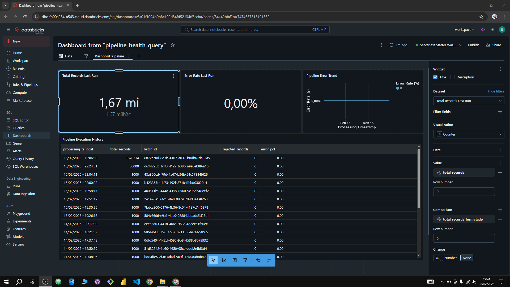
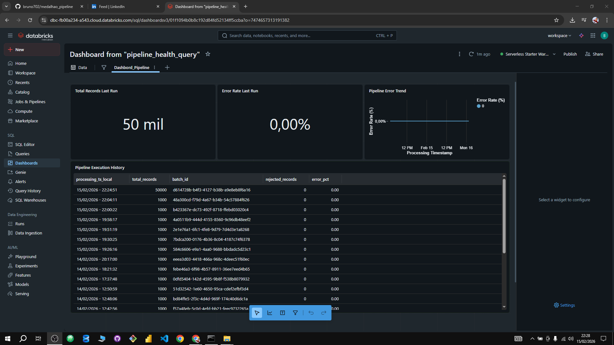
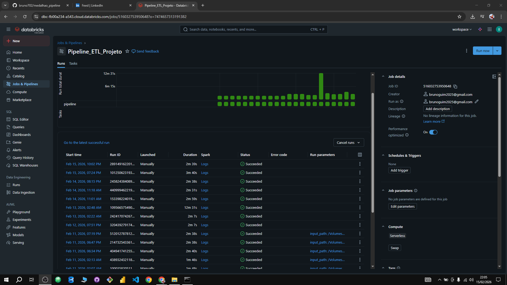
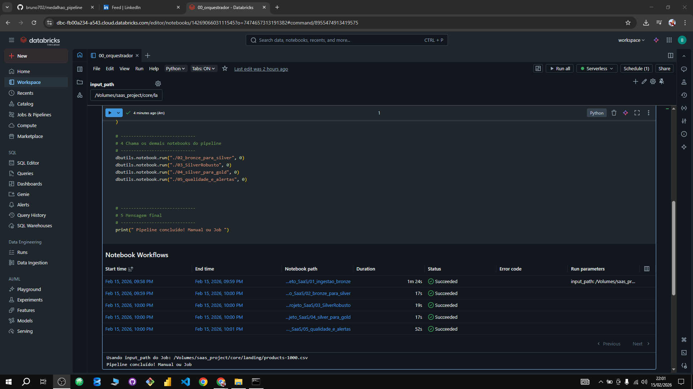
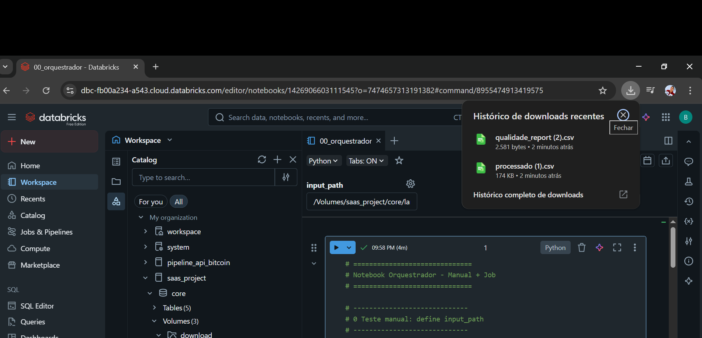

# Projeto Databricks: Pipeline de Dados End-to-End com PySpark

Concluí recentemente um pipeline completo no **Databricks**, desenvolvido em **PySpark**, que transforma dados brutos em informações limpas, consistentes e prontas para análise.  
O projeto combina **orquestração, tratamento de dados e monitoramento de qualidade**, mostrando habilidades práticas de ETL e engenharia de dados.

---

## Bronze (Ingestão Cruda)

* Recebe qualquer arquivo de entrada, sem exigir colunas específicas, garantindo **flexibilidade e escalabilidade**
* Valida o `input_path` e garante que o arquivo exista e não esteja vazio antes de processar
* Detecta automaticamente o **separador do CSV** (`;` ou `,`)
* Carrega o arquivo em um **DataFrame PySpark**, permitindo trabalhar com grandes volumes de dados
* Normaliza os nomes das colunas:

  * converte para minúsculas
  * substitui caracteres inválidos por `_`
  * remove underscores duplicados
* Gera um **CSV legível temporário** para inspeção ou uso externo
* Move o CSV final para o destino correto (`bronze.csv`) e remove arquivos temporários
* Adiciona a coluna `ingestion_time` com timestamp e timezone correto (`America/Sao_Paulo`) para rastreabilidade
* Grava o dataset final em **formato Delta** na tabela `saas_project.core.bronze_raw`

## 2 – Silver 1 (Tratamento Inicial)

* Leitura do dataset bruto da camada Bronze (`saas_project.core.bronze_raw`)
* Padronização de nomes de colunas (minúsculas, remoção de caracteres especiais e normalização de separadores)
* Remoção de registros duplicados
* Remoção de linhas totalmente nulas
* Limpeza básica de colunas de texto (remoção de espaços e valores inválidos convertidos para `NULL`)
* Identificação automática de colunas de data/hora e conversão para timestamp
* Separação de data e hora em novas colunas (`<coluna>_date` e `<coluna>_time`)
* Remoção das colunas originais de data/hora
* Reorganização da coluna `ingestion_time` para a última posição
* Gravação final do dataset na camada Silver (`Delta`)

 ### 3 – Silver Robusto (Tratamento Avançado)

* Padronização dos nomes das colunas (lowercase e remoção de caracteres especiais).
* Identificação automática dos tipos de dados (strings, numéricos e datas).
* Tratamento de valores inválidos em todas as colunas, independentemente do tipo (string, int, double etc.), convertendo para `null`.
* Limpeza avançada de campos textuais, incluindo:

  * remoção de quebras de linha e espaços excedentes;
  * normalização para letras minúsculas;
  * conversão de valores inválidos para `null`;
  * remoção de valores vazios;
  * descarte de campos com mistura de letras e números;
  * descarte de campos formados apenas por símbolos.
* Tratamento de valores `NaN` em colunas numéricas.
* Padronização de colunas numéricas por conversão de tipo (`cast` para `double`).
* Conversão e padronização de colunas de data e timestamp a partir de múltiplos formatos.
* Remoção de datas futuras.
* Tratamento específico da coluna `data_contratacao_date`.
* Reorganização de colunas de controle (`id`, `idx` e `ingestion_time`).
* Remoção de registros duplicados, desconsiderando a coluna `ingestion_time`.
* Persistência do dataset final tratado na camada **Silver 2** em formato **Delta**.

### 4- Gold (Dados Prontos para Consumo)
- Dados finais totalmente tratados e estruturados.  
- Prontos para dashboards, relatórios ou análises estratégicas.

### Beleza! Aqui está uma versão **mais enxuta**, mantendo só os pontos fortes e essenciais:

---

## 5- Qualidade Report – Pipeline Serverless com PySpark

* Inicializa SparkSession e lê dados da camada Silver.
* Estatísticas detalhadas por coluna: médias, desvio, min/max, percentis, outliers, comprimento de strings e top 5 valores.
* Identifica colunas com nulos, constantes e duplicados.
* Cria resumo geral do dataset: total de linhas, colunas e duplicados.
* Consolida tudo em **um único relatório CSV** pronto para auditoria e monitoramento de qualidade.

## Funcionalidades adicionais
- **Orquestrador:** coordena todos os notebooks automaticamente.  
- **Job automatizado:** permite execução contínua e programada do pipeline.  
- **Dashboard interativo:** acompanha execução, downloads e métricas de qualidade em tempo real.

---

Este projeto demonstra como **PySpark e Databricks** podem ser usados para construir pipelines **escaláveis e robustos**, capazes de tratar qualquer tipo de dado, gerar métricas detalhadas e entregar resultados confiáveis para análises e dashboards.

## Dasboard

## Dashboard

## Job

## Orquestrador

## Resultado CSVS arquivos tratados e qualidades 

